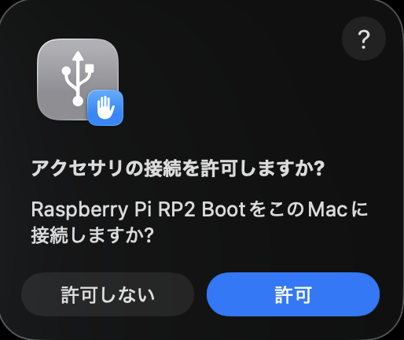
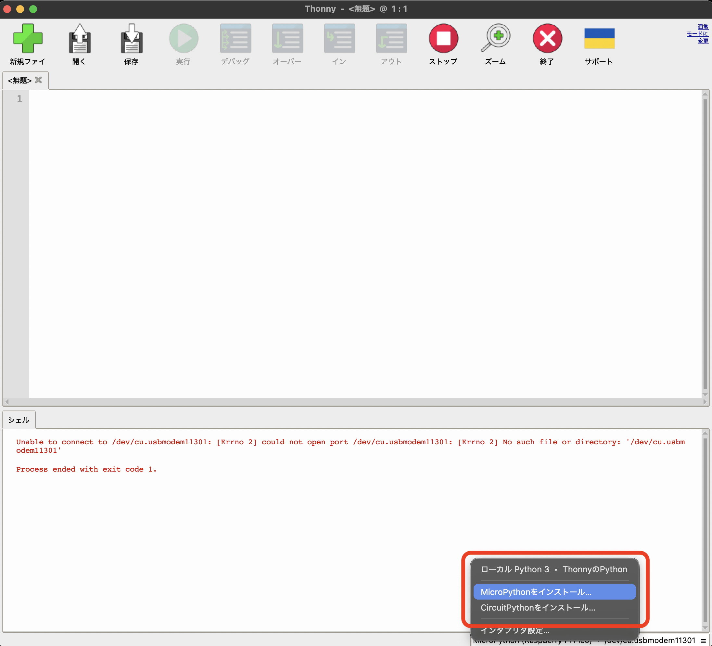
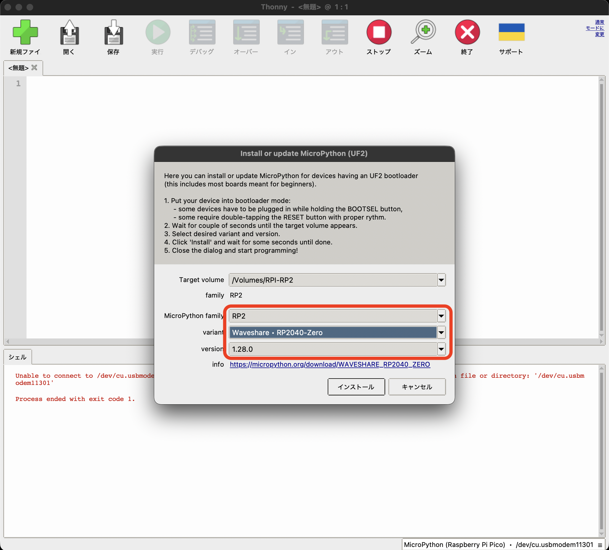

# ファシリテーター用準備ページ

## Loopian::AURA の作り方

## Micropython の書き込み

- Thonny を使って、micropython を RP2 ドライブに書き込む
    - board を PC の USB に接続
    - 以下のように、許可を求められるので、許可をクリック  
    

    - Window の右下から、「Micropythonをインストール..」を選択  
    

    - ボードの種類から「Waveshare RP2040 Zero」選択  
    

- Thonny は使わず、直接 micropython を RP2 ドライブに書き込む
    - [micropythonのダウンロードページ](https://micropython.org/download/WAVESHARE_RP2040_ZERO/)  
    - <a href="WAVESHARE_RP2040_ZERO-20260406-v1.28.0.uf2">ダウンロードしたmicropythonはこちら</a>

