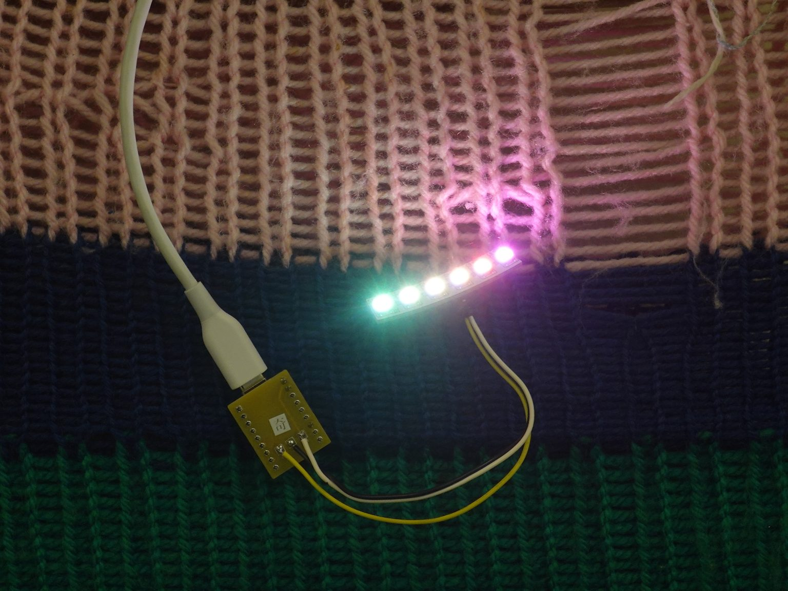

# AI × プログラミングでLEDを七色に光らせる！ -KAMOE LAB-

「ChatGPT」や「Gemini」などの生成AIは、生活のツールとしてすでに私たちの日常にとけ込みはじめています。実はプログラミングの世界でも、これらの生成AIが活用されはじめています。
    
本ワークショップでは、生成AIにコーディングの手伝いをしてもらいながらプログラミングをして、マイコンボード（小さなコンピューター）を使って自分だけの小さなイルミネーションをつくります。赤、緑、青などのフルカラー（RGB）のLEDの光り方を自分で考えて、光らせてみましょう。

## 本イベントについて

- 日時: 2026 9/27 (Sat) 10:00 - 15:00
- 場所: 浜松市鴨江アートセンター 201号室
- [お知らせ&申し込みページはこちら](https://kamoeartcenter.org/events/202602007/)

## 参加前の準備

- 事前に以下のページを参考に、プログラミングを行うためのアプリ thonny をインストールしてください
    - [Windows11対応：Thonnyのインストール手順と使い方【初心者向け】](https://www.xn--x8j5bya0mb35bzd1992bqgi.com/thonny-install-windows11-guide/)
    - Windows の方は、上記のページの「Thonnyのダウンロードとインストール」の通りにインストールします
    - Mac の方は、上記と同様にダウンロードすれば、通常と同様にインストールを行うことができます
        - ダウンロードの際、Intel Mac か、Apple Silicon かを選ぶ必要がありますので、ご自身の Mac の種類を事前に確認しておいてください

## 当日のサンプルプログラム

(ただいま準備中)

<!-- 
## ファシリテータ用の準備ページ

### Loopian::AURA の作り方
-->
